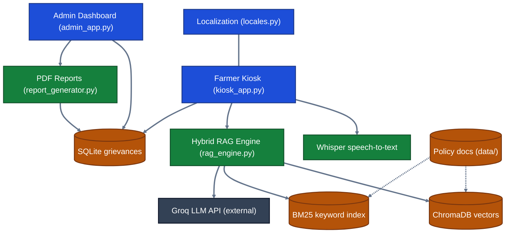
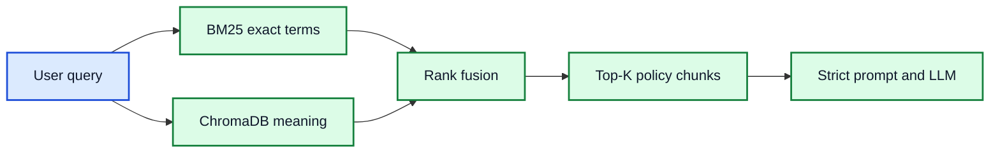
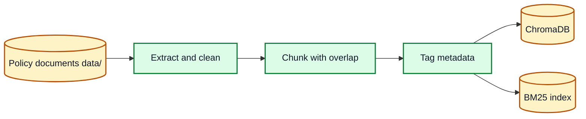
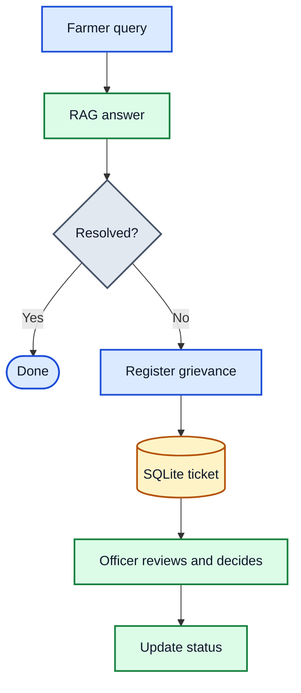

# 🌾 Sahakar-Vaani

### Voice-first AI assistant for cooperatives and farmers

Ask in your own language. Get answers grounded in official policy. Escalate to a real officer when AI isn't enough.

  
   
  <i>Farmer kiosk home screen: the farmer picks a language, and speech recognition, AI answers and voice playback all run in that language.</i>

---

## 📖 Overview

**Sahakar-Vaani** is a voice-first, multilingual assistant for Primary Agricultural Credit Societies (PACS), farming cooperatives, and rural communities in India.

A farmer speaks or types a question at a kiosk. A hybrid retrieval pipeline finds the relevant policy passages, and an LLM answers in plain language **with citations**. If the answer doesn't solve the problem, the farmer raises a **grievance ticket** that PACS officers review from a separate admin dashboard, so a human stays in the loop.

## 🎯 The Problem

| Challenge | Impact | Our approach |
|---|---|---|
| Complex policy language | Circulars and PACS frameworks are hard for non-experts to read. | Plain-language answers generated from the source text |
| Language barriers | Most portals are English or Hindi only. | Multilingual UI and localized responses |
| Low digital literacy | Web forms and menus are hard to use. | A voice-first kiosk |
| Hallucination risk | Generic chatbots can invent schemes or eligibility rules. | Answers come only from retrieved policy chunks, with citations |
| Unresolved cases | A chatbot cannot resolve disputes. | Grievance tickets routed to PACS officers |

---

## ✨ Features

| | Feature | Details |
|:---:|---|---|
| 🎙️ | **Voice input** | Record a question on the kiosk; Whisper transcribes it. |
| 🌐 | **Multilingual** | Localized UI and output language via `languages.json` and `locales.py`. |
| 🧠 | **Hybrid RAG** | BM25 keyword search and ChromaDB vector search are fused; the LLM answers only from retrieved chunks and cites sources. |
| 🔊 | **Read-aloud answers** | Each answer is shown on screen and spoken back. |
| 📝 | **Grievance tickets** | Unresolved issues are stored in SQLite (`db_manager.py`). |
| 👨‍💼 | **Admin dashboard** | Officers filter, review, and update tickets, and view usage analytics (`admin_app.py`). |
| 📊 | **PDF reports** | Export grievance and resolution summaries (`report_generator.py`). |

---

## 🏗️ Architecture

***Colors:** blue = interface · green = application and AI · amber = data stores · gray = external service. Dashed lines: `ingest.py` builds the indexes from policy documents.*

| Component | File | Role |
|---|---|---|
| Farmer Kiosk | `kiosk_app.py` | Voice/text input, answers, grievance form |
| Admin Dashboard | `admin_app.py` | Review tickets, update status, analytics |
| Whisper | (in kiosk) | Speech-to-text |
| Hybrid RAG Engine | `rag_engine.py` | BM25 + ChromaDB retrieval, LLM calls |
| PDF Report Generator | `report_generator.py` | Grievance and resolution reports |
| SQLite | `db_manager.py` | Grievance tickets and app state |
| ChromaDB / BM25 | built by `ingest.py` | Vector and keyword indexes |
| Localization | `locales.py`, `languages.json` | Multilingual UI and output |

---

## ⚙️ How It Works

### 1. Answering a question

### 2. Hybrid retrieval

BM25 is precise on scheme names, policy numbers, and numeric limits. Vector search handles paraphrases and colloquial wording. Fusing both covers what either alone would miss.

### 3. Building the knowledge base

Overlapping chunks preserve context across boundaries. Run `python ingest.py` once, and again whenever documents change.

### 4. Human-in-the-loop escalation

Ticket lifecycle:

---

## 🧰 Tech Stack

| Layer | Technology |
|---|---|
| App and UI | Python 3.10+, Streamlit |
| Speech-to-text | OpenAI Whisper |
| Retrieval | ChromaDB (dense), `rank_bm25` (sparse) |
| Embeddings | Sentence-Transformers |
| Generation | Groq API |
| Voice output | Text-to-speech |
| Storage | SQLite |
| Reporting | PDF generation |
| Localization | JSON + Python dicts |

---

## 🔮 Future Scope

| Idea | Goal |
|---|---|
| Regional dialect ASR | Fine-tuned speech models for rural Indian dialects |
| WhatsApp / SMS alerts | Notify farmers when a grievance status changes |
| Offline RAG | Lightweight local models for low-connectivity kiosks |
| Government API integration | Read-only links to state cooperative portals |

## 🌾 Expected Impact

- **Less friction** in reaching cooperative policy information
- **Wider inclusion** for non-literate and elderly farmers
- **More transparency** through structured grievance logs
- **Faster resolution** with standardized ticket tracking
